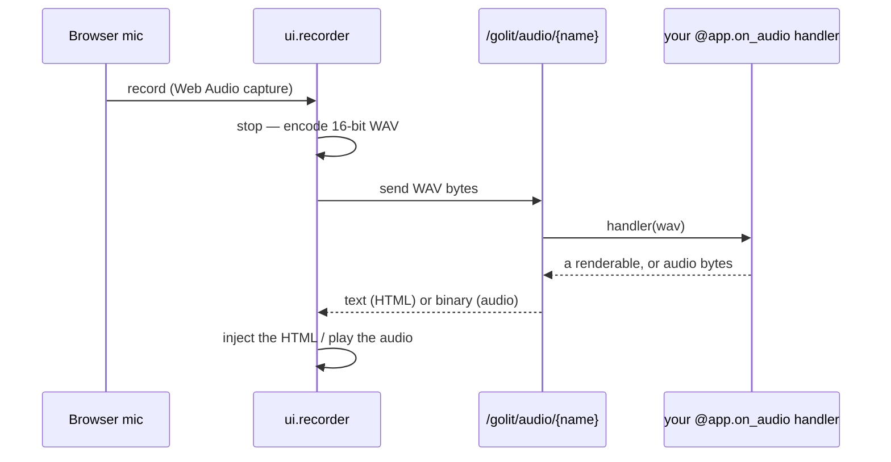

# Audio recording (microphone)

Some apps need the visitor's voice, not their camera: a voice note, a spoken command, a clip to transcribe or analyze. `golit.ui.recorder` captures the microphone **in the browser**, uploads the clip, and shows whatever your server handler makes of it — the audio mirror of the [browser camera](video-streams.md#the-other-direction-the-visitors-own-camera).

## The two halves

A recorder is a handler plus a component, the same split as [chat](websockets.md) and [camera](video-streams.md):

```python
import io
import wave

import golit.ui as ui
from golit import App, create_app

app = App(title="Voice")


@app.on_audio("note")            # ① runs on each recorded clip
def handle(wav: bytes):          # 16-bit PCM WAV bytes
    with wave.open(io.BytesIO(wav)) as w:
        seconds = w.getnframes() / w.getframerate()
    return ui.metric("Length", f"{seconds:.1f}s")   # shown back in the panel


@app.view
def live() -> str:               # ② where it records
    return ui.recorder("note", title="Voice note")


application = create_app(app)
```

Click to record, click to stop (or it auto-stops at `max_seconds`). `golit run app.py` and it just works.

## WAV, decodable with the standard library

The browser captures raw PCM with the Web Audio API and uploads a **16-bit mono WAV** — chosen so the server decodes it with Python's stdlib [`wave`](https://docs.python.org/3/library/wave.html), **no ffmpeg and no extra dependency**:

```python
import io
import wave

import numpy as np

with wave.open(io.BytesIO(wav)) as w:
    rate = w.getframerate()
    samples = np.frombuffer(w.readframes(w.getnframes()), dtype="<i2")
```

From there it's your handler's job — measure it, run speech-to-text, feed a model.

## What the handler returns

| Return | Effect |
| --- | --- |
| a **renderable** — str/HTML, a DataFrame, a `golit.ui` component | rendered and shown in the panel |
| **`bytes`** | sent back as audio and played in an inline `<audio>` (an echo, a TTS reply) |

Sync handlers — and a heavy transcribe — run in a worker thread, so the event loop never stalls; async handlers are awaited. Like the camera, one clip is in flight at a time: a new recording can't start until the current result is back.

## The component

```python
ui.recorder(name, *, title=None, max_seconds=30, hint=None, playback=True, download=True)
```

`max_seconds` caps the clip length (it auto-stops at the limit); `hint` is an optional caption under the button. `playback` (default) loads the clip you just recorded into an inline `<audio>` player so you can hear it; `download` (default) adds a link to save it as `recording.wav`. If the handler returns audio `bytes`, the player switches to playing that instead.

## How it works



!!! warning "Mic access needs a secure context"
    `getUserMedia` only works on **`https`** or **`localhost`**. On an insecure page — or a denied permission, no device, or a mic already in use — `ui.recorder` shows a clear notice (e.g. *"Mic blocked. Allow microphone access, then retry."*) instead of recording.

!!! note "A failing handler doesn't drop the recorder"
    If your `@app.on_audio` handler raises on a clip, Golit logs it and sends a short notice back; the recorder stays usable and the next clip is processed normally.

## Full example

- [`examples/audio_recorder/app.py`](https://github.com/boadzie/golit/tree/main/examples/audio_recorder) — records a clip and reports its duration, peak/RMS level, and a little waveform, all decoded with stdlib `wave` and numpy (no extra deps). Swap the body for Whisper or an STT API and return the transcript.

```
pip install golit
golit run examples/audio_recorder/app.py
```

## Reference

- [`golit.ui.recorder`](../reference/ui.md) — the component.
- [`App.on_audio`](../reference/app.md) — the clip-handler decorator.
