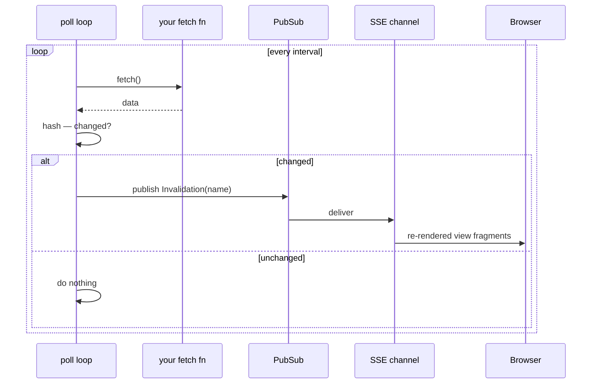

# Live data sources (polling)

Most golit nodes recompute when *you* change an input. But some data changes on its own — a Google Sheet a colleague is editing, an API, a file a job rewrites. `@app.poll` turns that into a first-class **live source**: golit fetches it on an interval and, when the content changes, pushes the re-rendered views to every open browser over [SSE](server-push.md). You write plain views; they update themselves.

## The shape

```python
import polars as pl
import golit.ui as ui
from golit import App, create_app

app = App(title="Live")


@app.poll("sheet", interval=3)        # fetch every 3s
async def sheet() -> pl.DataFrame:    # the fetch — return the latest data
    return await fetch_csv(SHEET_URL)


@app.view
def table(sheet) -> str:              # depends on the polled source by name
    if sheet is None:                 # None until the first fetch lands
        return ui.spinner(label="Loading…")
    return ui.table(sheet)


application = create_app(app)
```

`@app.poll(name, interval=...)` registers a **source node** named `name` plus a background poller. The decorated function is the fetch (sync or `async`); golit runs it every `interval` seconds, and your views depend on `name` like any other source.

## Only changes cost anything

Each fetch is fingerprinted (an md5 of its content). If the fingerprint is unchanged, golit does nothing — no re-render, nothing on the wire. When it changes, golit publishes an invalidation, force-recomputes the source, and pushes only the **changed view fragments** to every connected client. That's the same server-side-invalidation path [streaming sources and background jobs](server-push.md) use; polling is just a convenient producer for it.



## Notes

- **Sync or async fetch.** An `async def` fetch is awaited; a plain `def` runs in a worker thread, so a blocking request never stalls the event loop.
- **`None` until the first fetch.** The source is `None` until the first poll lands — have views render a loading state.
- **Errors are survived.** A fetch that raises is logged and retried on the next tick; the last good value stays on screen.
- **Per worker process.** Like [`@app.stream`](video-streams.md), one poller runs per worker — under multiple workers each polls. For a single shared fetch, pin the poller to one worker.

## Full example

[`examples/live_sheets/app.py`](https://github.com/boadzie/golit/tree/main/examples/live_sheets) streams a public **Google Sheet** (or any `.csv` URL): a poller fetches the CSV export SSRF-safely, and a table plus an auto-inferred chart update live as the sheet changes. Point `GOLIT_SHEET_URL` at your own "anyone with the link can view" sheet and edit it to watch the dashboard move.

```
golit run examples/live_sheets/app.py
```

A polled source composes with anything a view can return. [`examples/live_great_table/app.py`](https://github.com/boadzie/golit/tree/main/examples/live_great_table) feeds the same live sheet into a [Great Tables](../tutorial/views.md#returning-a-great-tables-table) `GT` object — a *formatted* display table that redraws itself over SSE, no client code (`pip install "golit[tables]"`).

## Reference

- [`App.poll`](../reference/app.md) — the decorator.
