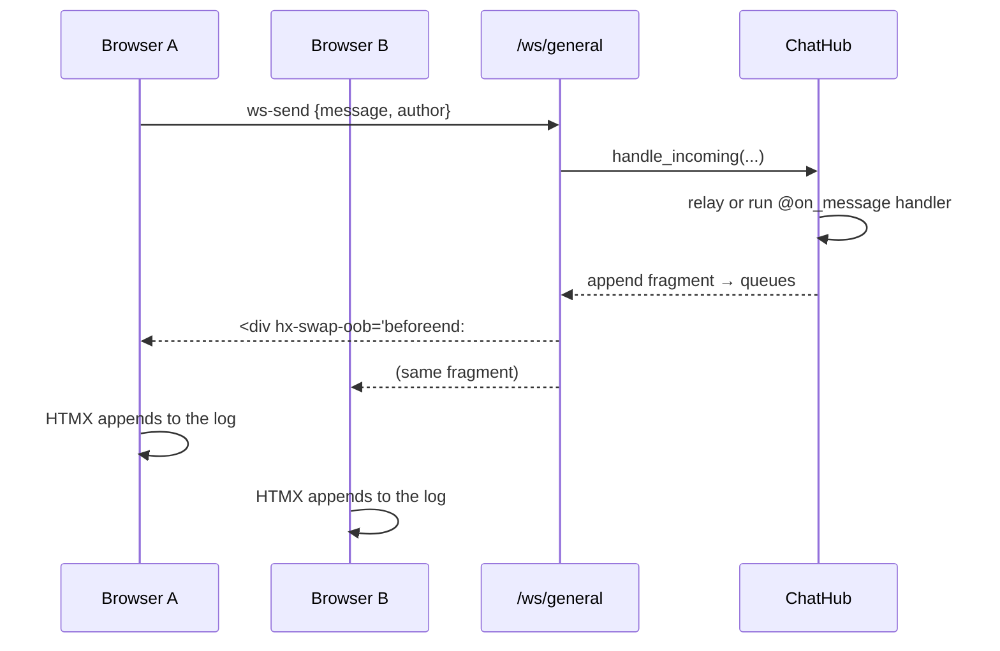

# WebSocket chat

Golit's push channel is [SSE](server-push.md) — server→client, unidirectional, which is the right shape for reactive invalidations. But some features are *genuinely bidirectional*: a chat, a presence indicator, collaborative editing. Those are the case the [architecture](../concepts/architecture.md#tier-2-transport-htmx-lets-plot) reserves a real WebSocket for.

Golit ships that as a **WebSocket chat channel** that stays on-brand: the wire format is still **server-rendered HTML fragments**, just two-way. The browser connects with HTMX's `ws` extension and sends form fields over the socket; the server renders each message and broadcasts it as an out-of-band append. No client framework, no JSON-to-DOM glue.

## The component

Drop a chat panel into any view with [`ui.chat`](../tutorial/ui-components.md):

```python
import golit.ui as ui
from golit import App, create_app

app = App(title="Chat")


@app.view
def room() -> str:
    return ui.chat("general", title="Team chat")


application = create_app(app)
```

Run it with `golit run app.py` and open it in **two browser tabs** — type in one and it appears in both. That's the default behavior: every message on the channel `"general"` relays to all connected clients (a room).

`ui.chat(channel, *, author="You", title=None, placeholder="Message…", height=384)`. The `channel` is the room id (it becomes the WebSocket path, `/ws/<channel>`); `author` is the sender's display name.

## Adding behavior: `@app.on_message`

A room with no handler just relays. Register a handler and it **owns** each message — decide what to send, to whom. The handler receives the `ChatMessage` and a `MessageContext`:

```python
@app.on_message("general")
async def handle(msg, ctx):
    await ctx.broadcast(msg.text, author=msg.author)        # relay to the room
    if msg.text.lower().startswith("/bot"):
        await ctx.reply("🤖 beep boop", author="Bot")        # only the sender sees this
```

`MessageContext` gives you two ways to respond:

| Method | Reaches | Stored in history? |
| --- | --- | --- |
| `await ctx.broadcast(text, *, author="Bot")` | **everyone** on the channel | yes |
| `await ctx.reply(text, *, author="Bot")` | **only the sender's** connections | no |

!!! note "A handler replaces the default relay"
    Without a handler, Golit relays each message automatically. *With* one, you're in charge — if you want the message to reach the room, call `ctx.broadcast` yourself (as above). This is what lets a handler moderate, transform, or drop messages instead of relaying them.

The handler may be sync or async. Use `@app.on_message` (bare) or `@app.on_message("channel")` to scope it; a bare handler catches every channel.

### Patterns this covers

=== "Multi-user room"

    ```python
    # No handler at all — pure relay.
    @app.view
    def room() -> str:
        return ui.chat("general")
    ```

=== "Bot / assistant"

    ```python
    @app.view
    def room() -> str:
        return ui.chat("support")

    @app.on_message("support")
    async def assistant(msg, ctx):
        answer = await my_llm(msg.text)      # your model call
        await ctx.reply(answer, author="Assistant")
    ```

=== "Moderated room"

    ```python
    @app.on_message("general")
    async def moderated(msg, ctx):
        if is_ok(msg.text):
            await ctx.broadcast(msg.text, author=msg.author)
        else:
            await ctx.reply("Message blocked.", author="System")
    ```

## How it works



1. `ui.chat` renders a `<div hx-ext="ws" ws-connect="/ws/general">` with an empty log and a `ws-send` form.
2. On submit, HTMX sends the form fields as JSON over the socket.
3. The `/ws/{channel}` route hands the payload to the **`ChatHub`**, which relays (or runs your handler).
4. Each outgoing message is rendered to a bubble wrapped in `hx-swap-oob="beforeend:#…-log"` and pushed to every relevant connection; HTMX appends it to the log by id.
5. On connect, the hub replays a short **history** so a new joiner sees recent messages.

The hub holds only outbound queues (one per connection), never sockets — the same queue-per-connection pattern the [SSE manager](server-push.md) uses — so writes never race and the logic is easy to test.

!!! danger "Messages are untrusted input"
    Unlike a view you author, chat text comes from users. Golit **escapes** every author and message body when rendering the bubble, so markup in a message is shown, not executed. If you build your own message HTML in a handler, escape it yourself (`from golit.widgets import esc`).

## Scaling

Today the broadcast is **in-process**: a room spans the connections on one worker. That's the single-node default, and it's complete — example, tests, and this page.

Spanning a room across a multi-worker fleet is the same problem (and the same solution) as SSE: publish each message to Redis so every worker delivers it to its local connections. The `ChatHub` is shaped for exactly that drop-in — see [Deployment & scaling](deployment.md) for the affinity/fan-out model it would reuse.

!!! warning "The server needs a WebSocket backend, and your proxy must allow the upgrade"
    `golit run` serves under Uvicorn, which needs a WebSocket implementation to accept the `/ws` upgrade — Golit depends on **`websockets`** for this, so a plain `pip install golit` works out of the box. (Without one, Uvicorn answers the handshake with `405 Method Not Allowed` and the chat silently does nothing.)

    Behind a reverse proxy, forward the upgrade headers on the WebSocket path, or the handshake never reaches the app. For nginx:

    ```nginx
    location /ws/ {
        proxy_pass http://golit;
        proxy_http_version 1.1;
        proxy_set_header Upgrade $http_upgrade;
        proxy_set_header Connection "upgrade";
        proxy_read_timeout 1h;            # keep idle sockets open
    }
    ```

    The same cookie-hash affinity from [Deployment & scaling](deployment.md) applies: a client's `/ws` connection must land on the worker holding its session.

## Full example

[`examples/chat/app.py`](https://github.com/boadzie/golit/tree/main/examples/chat) is a runnable room with a `/bot` reply — the room-broadcast + handler-hook model end to end.

## Reference

- [`golit.ui.chat`](../reference/ui.md) — the component.
- [`ChatHub`, `ChatMessage`, `MessageContext`](../reference/server.md#chat) — the server side.
