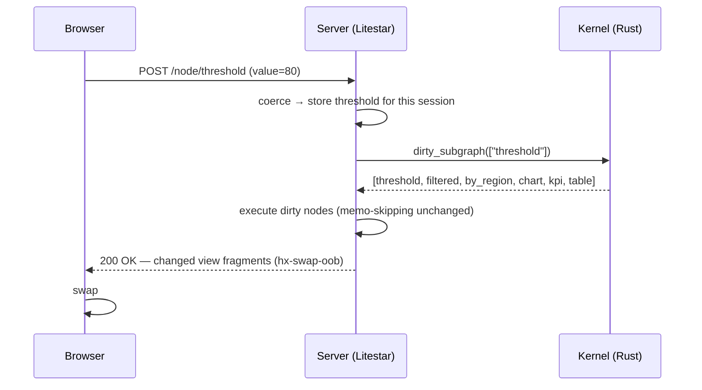
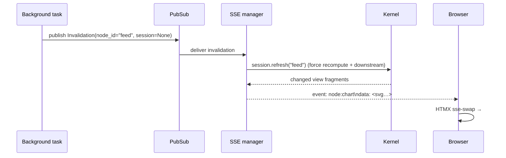

# How a change flows

Let's trace a single interaction end to end. Same app as the tutorial: a slider feeds a filter, which feeds a chart, a KPI, and a table; an `overview` view depends only on the data.

## The setup (initial load)

On the first `GET /`:

1. The server creates a **session** — a fresh kernel graph + value registry — and sets a `golit_session` cookie.
2. It runs the whole graph once (`initial_render`), computing every node and rendering every view fragment.
3. It returns the full HTML page: the controls panel and every view, each as a `<section id="…">`.

The page also opens one **SSE connection** (`GET /events`) that stays alive for server-pushed updates.

## Path 1 — POST in (the common case)

The user drags the slider and releases. Alpine showed the live number during the drag (Tier 3); the release commits.

1. **POST in.** HTMX posts the committed value to `POST /node/threshold`.
2. **Coerce & store.** The widget coerces `"80"` to `int`; the session stores it.
3. **Schedule.** The kernel returns the dirty subgraph in topological order.
4. **Execute with memo.** Each node runs only if its input hash changed (see [the reactive model](reactivity.md)). `overview` isn't in the subgraph at all — it's never considered.
5. **Respond with fragments.** Only the **changed view fragments** come back, each tagged `hx-swap-oob="true"`, so HTMX swaps them into `#chart`, `#kpi`, `#table` by id — all in the single POST response. No SSE, no second round trip.

If a node memo-hits (its value didn't change), its view isn't in the response, so nothing swaps for it.

## Path 2 — SSE out (server-initiated)

Some changes don't originate with the requesting client: a streaming source advances, a background job finishes, or a shared node is recomputed for everyone. There's no POST to ride — the server has to **push**.

1. A node goes dirty server-side; an **`Invalidation`** is published to the [`PubSub`](../advanced/server-push.md).
2. The SSE manager receives it and calls `session.refresh(node_id)` for each affected session — forcing the node and recomputing downstream.
3. Each changed view fragment is emitted as a **named event**, `node:<id>`.
4. HTMX's SSE extension swaps it into `#<id>` **by name** — the same fragment-by-name contract as the POST path, just pushed.

The event name *is* the node identity. When `chart` goes dirty server-side, Golit emits `event: node:chart` and HTMX swaps `#chart`.

## Why two channels

They match the actual direction of data:

- A user changing **their own** inputs is a request/response — POST handles it with zero persistent connection and the fragments come back inline.
- A change **pushed to** the user is unidirectional and server-initiated — SSE's exact shape.

Across a horizontally-scaled fleet, the SSE path is fed by **Redis pub/sub**: an invalidation is published once and every worker delivers it to the sessions it holds. That's the subject of [Deployment & scaling](../advanced/deployment.md).

## What's on the wire

In both paths the payload is the **final UI** — an HTML/SVG fragment — not JSON for a client to reconcile. There's no client-side diffing framework and (for static charts) no charting runtime. The bytes you send are the bytes the browser displays.
