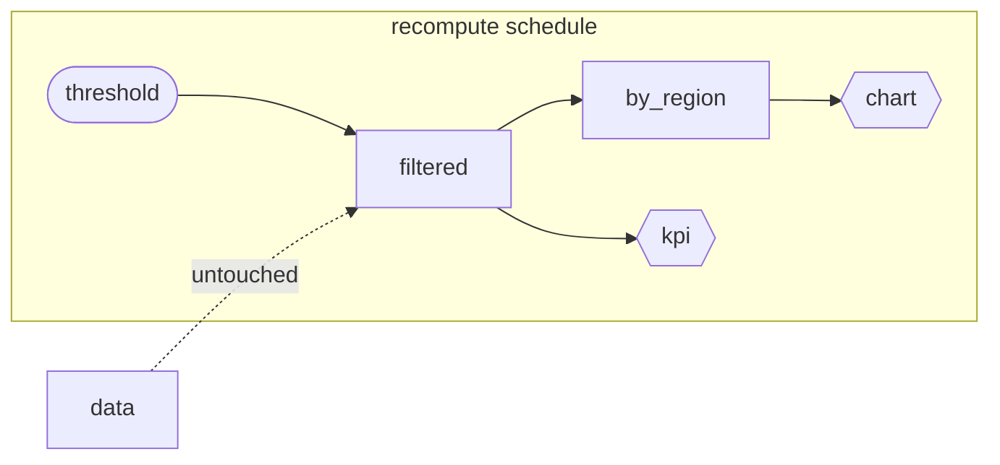

# The reactive model

This is the algorithm at Golit's core. It lives in a **Rust kernel** (`src/core.rs`, exposed to Python via PyO3) that owns the **graph and its state** — never the data. Node values (Polars frames, scalars, rendered fragments) stay on the Python side; only node ids and `u64` content hashes cross the boundary.

## The graph

At startup Golit registers every node and its inbound edges, then **builds** the graph:

- It validates the graph is a **DAG** — a cycle raises an error naming the tangled nodes.
- It computes a **stable topological order** using Kahn's algorithm with a min-heap, so among otherwise-ready nodes, insertion order wins. The order is deterministic run to run.
- It caches that order and a position index, so the hot-path queries are fast.

Each node carries a `kind` (input / source / reactive / view), its dependencies, its dependents, a `state`, and a memo `hash`.

## Node states

Every node is in one of three states:

| State | Meaning |
| --- | --- |
| **clean** | Up to date; its stored value is valid. |
| **dirty** | Needs (re)computation. |
| **computing** | Currently executing (set by the scheduler during a run). |

New nodes start **dirty** with no hash. The first render computes everything once; after that, the graph mostly stays clean.

## What happens on a change

When an input commits a new value, the kernel does two things.

### 1. Compute the dirty subgraph

`dirty_subgraph(seeds)` returns the **seeds plus every transitively affected node, in topological order**. It's a breadth-first closure over *dependents*, then sorted by the cached topo position. Crucially, it's a **pure query** — no mutation — because it runs on every single interaction and must be cheap.

Nodes *upstream* of the change (like `data` here) are never in the subgraph. Nodes on unrelated branches aren't either.

### 2. Execute, with memoization

Golit walks the schedule in order. For each node, it asks: do my inputs hash the same as last time?

- **Hash differs** (or no hash yet) → the node is **executed**, its value stored, and it's committed **clean** with the new hash.
- **Hash matches** → a **memo hit**: the stored value is reused untouched, and the node is just re-marked clean.

The kernel exposes this as `needs_recompute(id, input_hash)` and `set_clean(id, hash)`. The decision is pure hash comparison — no value ever crosses into Rust.

## Why memo hits cascade

This is the subtle, powerful part. A node's input signature is the hash of its **dependencies' current values**. If a dirty node recomputes to the *same* value (its own hash unchanged), then its dependents hash *their* inputs and find no change either — so they memo-hit too.

A change that fizzles out — a slider nudge that doesn't alter the filter result — stops propagating the moment a value stops changing. Nothing further executes, and nothing goes on the wire.

## Content hashing

The input signature is a `u64`. It's computed in Python (`golit.hashing`) and only the number is handed to the kernel:

- **Scalars** use Python's builtin `hash` (per-process stable — which is all that's needed, since hashes only have to be consistent *within one run*).
- **Polars frames** get a cheap structural + content hash: the schema (names + dtypes), the shape, and `df.hash_rows().sum()`. **Series** are hashed similarly.
- **Bytes / file buffers** (e.g. an upload's `BytesIO`) hash their contents.
- An ordered list of input hashes is folded into one signature with **FNV-1a**.

!!! note "Hashing is structural, not deep equality"
    Two frames with the same schema, shape, and row hashes are treated as equal. This is fast and correct for the memo's purpose; it does not attempt value-level deep comparison of arbitrary Python objects.

## The registry is the cache

There's no separate memo store. Each session keeps a **registry** of node values, and because a clean node's value is left untouched, *the registry itself is the cache*. A memo hit literally means "leave `values[id]` as is". Simple, and it means cache size tracks the graph, not history.

## The payoff

Put together: propagation bounds the work to the change's downstream cone; memoization prunes that further to only what genuinely differs; and the whole graph walk runs in compiled Rust. That's how update cost ends up proportional to the **change**, not the program — the property the [benchmarks](../about/benchmarks.md) are designed to prove.

## See also

- [Architecture](architecture.md) — where this kernel sits in the larger system.
- [How a change flows](data-flow.md) — the same story from the request's point of view.
- The kernel's public API, if you want to poke at it: [`golit.kernel_version`](../reference/server.md) and the `Graph` class.
