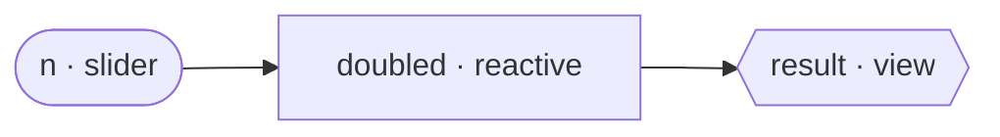

# Your first app

Let's build the smallest Golit app that does something real: a number that doubles as you drag a slider.

## The whole thing

```python title="app.py"
from golit import App, create_app, slider

app = App(title="Doubler")  # (1)!


@app.reactive  # (2)!
def doubled(n: int = slider(0, 50, default=10)) -> int:  # (3)!
    return n * 2


@app.view  # (4)!
def result(doubled: int) -> str:  # (5)!
    return f"<p class='text-3xl font-mono'>{doubled}</p>"


application = create_app(app)  # (6)!
```

1. An `App` is the blueprint. `title` shows in the page header and the browser tab.
2. `@app.reactive` registers a **compute node**. It re-runs only when its inputs change.
3. The parameter's default is a `slider` **widget**, so `n` becomes an **input node**. Its name (`n`) is the input's id.
4. `@app.view` registers a **view node** — a renderable leaf that produces UI.
5. The parameter `doubled` is named after the reactive node above, so this view **depends** on it. When `doubled` changes, this fragment re-renders.
6. `create_app` turns the blueprint into a runnable [ASGI](https://asgi.readthedocs.io/) application.

## Run it

```bash
golit run app.py
```

Open <http://127.0.0.1:8000>. Drag the slider — the number doubles, live.

## What just happened

You declared three nodes and one edge each:



- `n` is an **input**. Its value comes from the browser.
- `doubled` is a **reactive** node. It reads `n` and computes.
- `result` is a **view**. It reads `doubled` and renders HTML.

Golit never asked you to wire these together. It read the **parameter names** of each function and inferred the graph: `doubled` takes a parameter `n` (a widget), `result` takes a parameter `doubled` (another node). That inference is the heart of the programming model, and the next chapter is all about it.

When you move the slider, only the path `n → doubled → result` runs. In an app this small that's everything — but as soon as you add a second view that *doesn't* depend on `n`, you'll see Golit leave it untouched.

!!! note "No `if __name__ == '__main__'`"
    `golit run app.py` finds your `application` (or even a bare `app`) and serves it under Uvicorn. You can also point any ASGI server at `application` directly — see [Running your app](running.md).

## Next

Now the important part: **[The reactive graph](the-graph.md)** — the three node kinds and exactly how dependencies are inferred.
