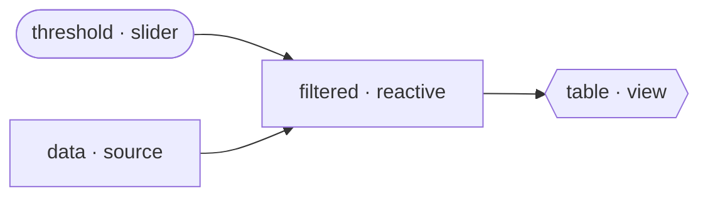

# The reactive graph

This is the core mental model. Once it clicks, everything else in Golit is just surface area.

## Nodes are plain functions

You declare nodes by decorating ordinary Python functions. There are three kinds:

| Decorator | Kind | What it's for |
| --- | --- | --- |
| `@app.source` | **source** | Bring data *in* — read a CSV, query a DB, return a sample frame. May depend on inputs. |
| `@app.reactive` | **reactive** | Transform upstream data — filter, aggregate, join. The workhorse. |
| `@app.view` | **view** | Render a UI fragment from upstream values. A renderable leaf. |

The function's **name is the node's id**. Registering two nodes with the same name raises an error.

```python
import polars as pl
from golit import App, slider

app = App(title="Sales")


@app.source
def data() -> pl.DataFrame:
    return pl.DataFrame({"region": ["N", "S", "E"], "revenue": [120, 200, 95]})


@app.reactive
def filtered(data: pl.DataFrame, threshold: int = slider(0, 200, default=50)) -> pl.DataFrame:
    return data.filter(pl.col("revenue") > threshold)


@app.view
def table(filtered: pl.DataFrame) -> pl.DataFrame:
    return filtered
```

## Dependencies are inferred from parameters

Golit doesn't ask you to declare edges. It inspects each function's signature and classifies every parameter:

<div class="golit-grid" markdown>

<div markdown>
### A node name → an **edge**
A parameter named after another registered node creates a dependency edge. `filtered(data, …)` depends on the `data` node; `table(filtered)` depends on `filtered`.
</div>

<div markdown>
### A widget default → an **input**
A parameter whose default value is a [widget](inputs.md) becomes an **input node**, named after the parameter. `threshold: int = slider(...)` creates an input `threshold`.
</div>

<div markdown>
### A plain default → a **constant**
A parameter with an ordinary default (not a widget, not a node name) is just a constant passed at call time. Not part of the graph.
</div>

</div>

This is the same idea as FastAPI's `Depends()` — the *default value* declares what the parameter is. (It's why Golit disables ruff's `B008`: a widget in a default is intentional, not a bug.)

!!! warning "Unresolvable parameters fail loudly"
    If a parameter is **none** of the above — not a widget, not a known node, and has no default — Golit raises a `ValueError` when the graph is built. Every parameter must resolve to something.

## The graph that builds

The example above compiles to:



Golit validates that the graph is a **DAG** (no cycles), computes a stable topological order, and is then ready to run.

## What runs on a change

Here's the payoff. When `threshold` changes:

1. `threshold` is marked **dirty**, and dirtiness propagates downstream: `threshold → filtered → table`.
2. Golit recomputes exactly that subgraph, in topological order.
3. `data` is **upstream** of the change, so it's never touched — its frame stays resident.
4. Only `table` is a view, so only its fragment is re-rendered and swapped.

Add a second view that depends only on `data`:

```python
@app.view
def overview(data: pl.DataFrame) -> str:
    return f"<p>{data.height} rows total</p>"
```

Now moving the slider re-renders `table` but **not** `overview` — `overview` isn't downstream of `threshold`, so Golit skips it entirely. That's the difference from a full-rerun framework: cost tracks the change, not the program.

## Memoization: even less work

Propagation decides *which* nodes are candidates to re-run. **Memoization** decides whether each one actually has to.

Every node remembers a content hash of the inputs it was last computed from. Before re-executing a dirty node, Golit hashes its current inputs:

- **Hash differs** → inputs really changed → execute, store the new value.
- **Hash matches** → inputs are identical → **memo hit**, reuse the stored value, and the *unchanged result cascades* — downstream nodes see no change either.

So if you nudge the slider but the filter result is identical (say, no rows crossed the threshold), `filtered` recomputes, hashes the same, and `table` never re-renders. Nothing goes on the wire.

!!! tip "You get this for free"
    You don't annotate anything for caching. Memoization is structural: a node is the cache, keyed by its inputs. The [Concepts](../concepts/reactivity.md) section explains the hashing.

## Building the graph

You usually never call it yourself, but for completeness: `app.build()` resolves every parameter and validates the graph. `create_app(app)` (and the first request) call it for you. Building twice is cheap and idempotent; registering a new node marks the blueprint dirty so it rebuilds.

## Next

You've seen `slider` and a frame. Now the full input palette: **[Inputs & widgets](inputs.md)**.
